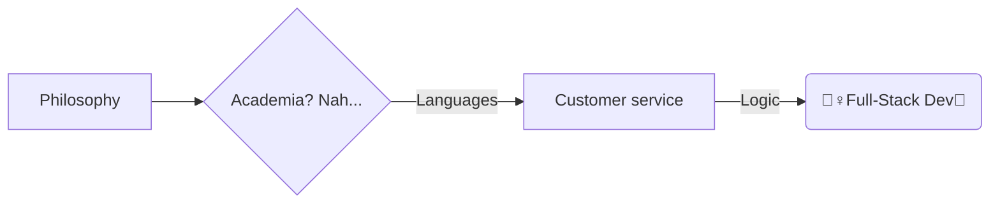

# Hi there, I'm Natalie! 👋 
 

 - [ ] ^--Did you check it out? 😊

💻 Full-Stack developer in the making 🤓 | Polyglot 🗣️ (6 spoken languages🌍) | Recovering perfectionnist💯 (trying to find the ✨perfect✨😉 balance between *unrealistically ideal right now* and: done, works, looks good, and could *later* be improved if need be). Oh, I also have a master's degree in philosophy btw 😊.
# In a nutshell🐚 (<--only nut-related icons available would not convey their shell) 

# What I've done so far

Well, I created [this](https://www.notion.so/Naty-s-Dev-Dashboard-1e511538cbc480d3889fc71831217a2b) Notion dashboard to keep track of things. It's still a work in progress in itself.

## What I'm up to

 - Diving deeper into React so that I can turn the simple Random Excuse Generator, that I created as a 4GeekAcademy mandatory mini-project, into a much more complex and customizable one.   
 - I'm planning on creating the website for a restaurant that doesn't have one yet... But I'm brainstorming and starting before actually offering this to them. If they're not interested, I'll just do a fictional restaurant website.  
 - And well, I guess it goes without saying, I'm following the bootcamp and doing those required readings and projects.

## Dev toolkit

- 🛠️ current stack: JavaScript, Rreact, HTML, CSS, Git, Bootstrap
- 🌱🎯 learning (with4Geeks+on my own): Further React, Tailwind

## GitHub Stats📊📈

## Fun Facts About Me⚡ 
- ⚙️ My favorite subject in Philosophy was Logic. One time, doing a Logic homework at my then student residence, a friend in tech was passing by and said something like "Oh, that actually looks like something I'd do for my classes!"... Whence my curiosity for web development spawned 🐣  
- 🌍 Amongst my 6 spoken languages:
	 -  🇨🇴🇫🇷🇺🇸3 are at native to near-native level
	-  🇸🇪Only 1 I fully learned on Duolingo🦉
		-  🙈And I have played with about 16 languages on Duolingo just for fun, without any intention of actually learning them 😇

