# Hi there, I'm Natalie! 👋 
 

 - [ ] ^--Did you check it out? 😊 (Left it behind a while ago, but might resume it later)

💻 Full-Stack developer in the making 🤓 | Polyglot 🗣️ (6 spoken languages🌍) | Recovering perfectionist💯 (trying to find the ✨perfect✨😉 balance between *unrealistically ideal right now* and: done, works, looks good, and could *later* be improved if need be). Oh, I also have a master's degree in philosophy btw 😊.
# In a nutshell🐚 (<--only nut-related icons available would not convey their shell) 

```mermaid
flowchart LR
    A["Philosophy"] --> D{"Academia? Nah..."}
    D -- Languages --> C["Customer service"]
    C -- Logic --> B("🙋‍♀️Full-Stack Dev🎯")

```

# What I've done so far and what I'm up to

- Class mini-projects (some straight-up, some with bonus front-end polish).
- Working on an education app and restaurant app for acquaintances (awaiting their feedback to go forward)
- Brainstorming spin-offs from older projects that might grow into something more.
- Planning two personal projects.
- Currently building the final bootcamp project with my assigned team.

## Dev toolkit

- 🛠️ current stack: JavaScript, React, HTML, CSS, Git, GitHub, Bootstrap, Python (Flask), REST APIs, SQL, Unit Testing,
    Bash, Fetch API, DOM manipulation, Agile workflows, basic authentication
- 🌱🎯 planning to learn: Tailwind CSS and contributing to open source.

## GitHub Stats📊📈

## Fun Facts About Me⚡ 
- ⚙️ Favorite subject in Philosophy: Logic.
A tech friend once nearly mistook my homework for code — and that curiosity eventually led here 🐣
- 🌍 Among my 6 spoken languages:
	 -  🇨🇴🇫🇷🇺🇸 3 are at native to near-native level
	-  🇸🇪 1 was fully learned on Duolingo🦉
		-  🙈And I have played with about 16 languages on Duolingo just for fun, without any intention of actually learning them 😇

